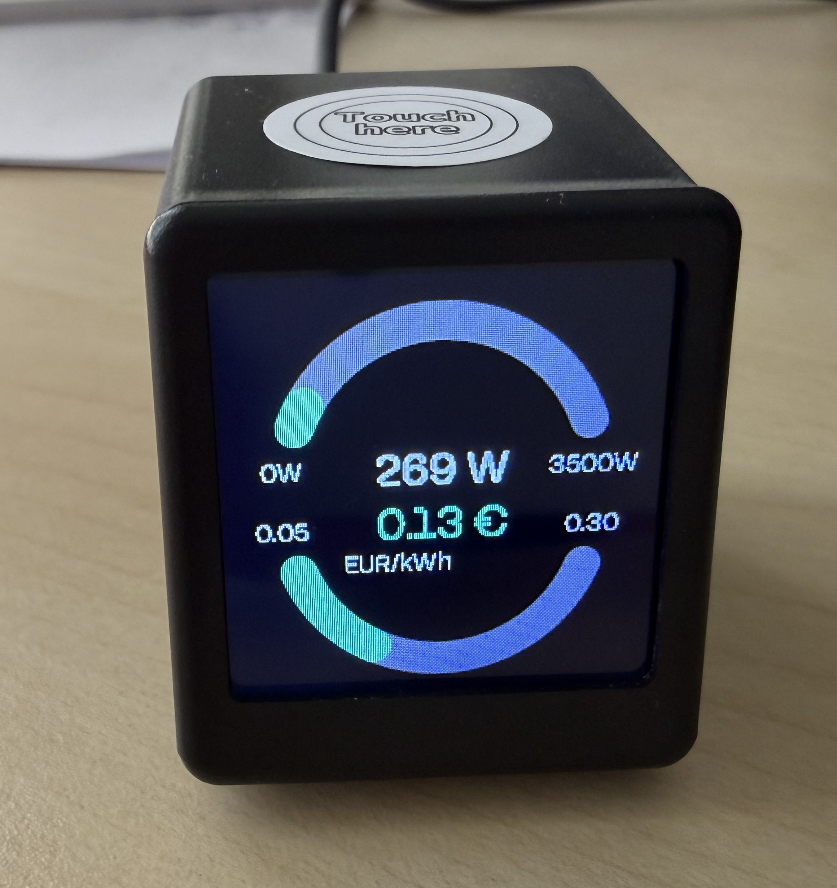
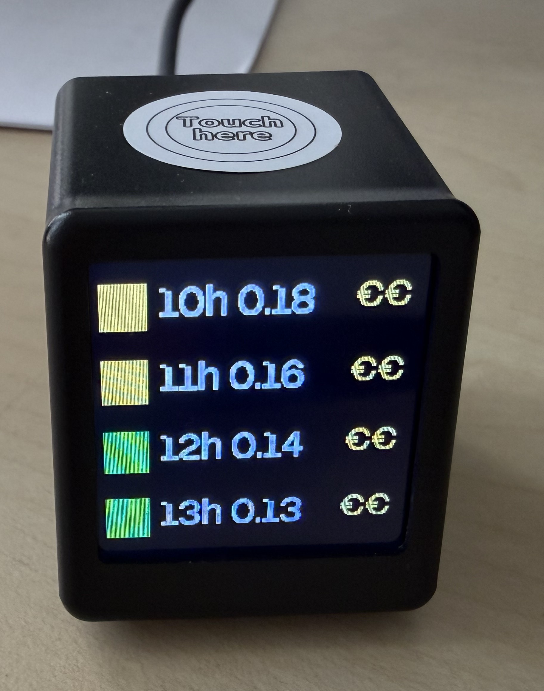

# ESPHome PVPC Display for Geekmagic SmallTV Pro

This project is specifically built for the **Geekmagic SmallTV Pro** display (ESP32 + ST7789 240x240) and shows electricity data from Home Assistant.

Current firmware stack in this repository:

- ESPHome `2026.3.3`
- LVGL `8.4.0`

## Screenshots

### Dashboard view (current power + current price)



### Hourly view (next 4 hours)



## What this project does

`esphome-pvpc.yaml` configures the device with two pages:

- **Hourly page:** next 4 hourly prices with color bands (green/yellow/red).
- **Dashboard page:** live house power (W/kW) and current energy price (EUR/kWh) using dual arc gauges.
- **Touch page switch:** GPIO32 touch input toggles between both pages.
- **Runtime tuning:** threshold values are exposed as template numbers in Home Assistant.

## Rendering and UI model

- UI is implemented with **LVGL** pages/widgets (not custom pixel drawing lambdas).
- Display driver uses `mipi_spi` + `ST7789V` at `240x240`, with `color_depth: 16`.
- Dashboard arcs are native LVGL `arc` widgets with runtime updates from Home Assistant sensors.

## Data refresh behavior

- UI refresh runs periodically every `30s`.
- Dashboard values also refresh **immediately on sensor update** (`pvpc_current_price` and `house_power` `on_value`).
- Manual page switch triggers an immediate `refresh_ui` run.

This means both screens keep their values warm in the background, and switching pages should show current data right away.

## Requirements

- ESPHome (Home Assistant addon or CLI).
- Home Assistant with ESPHome API enabled.
- Geekmagic SmallTV Pro hardware.
- One Home Assistant sensor with:
  - current price as the sensor state.
  - hourly price attributes named `price_00h` ... `price_23h`.
- One Home Assistant sensor for live house power.

## Home Assistant sensor customization (important)

By default, the YAML uses:

- Price sensor: `sensor.esios_pvpc_2`
- Power sensor: `sensor.sensor_consumo_electrico_power`

If your entities are different, edit `esphome-pvpc.yaml` in these blocks:

1. **Current price sensor** (`sensor:` block)

```yaml
sensor:
  - platform: homeassistant
    id: pvpc_current_price
    entity_id: sensor.esios_pvpc_2
```

Replace `sensor.esios_pvpc_2` with your own current-price entity.

2. **Power sensor** (`sensor:` block)

```yaml
sensor:
  - platform: homeassistant
    id: house_power
    entity_id: sensor.sensor_consumo_electrico_power
```

Replace `sensor.sensor_consumo_electrico_power` with your own power entity.

3. **Hourly price attributes** (`text_sensor:` block)

All hourly rows currently point to the same entity (`sensor.esios_pvpc_2`) and read attributes `price_00h` to `price_23h`.

Example entries:

```yaml
text_sensor:
  - platform: homeassistant
    id: price_00h
    entity_id: sensor.esios_pvpc_2
    attribute: "price_00h"

  - platform: homeassistant
    id: price_01h
    entity_id: sensor.esios_pvpc_2
    attribute: "price_01h"
```

If your integration uses a different entity or attribute names:

- change each `entity_id` in the `text_sensor:` block.
- update every `attribute` name to match your integration output.

Tip: if your attributes are named differently (for example `hour_00`, `hour_01`, ...), update all 24 entries to keep the display logic consistent.

## Dashboard arc customization

If you want to tune arc direction/placement/behavior, edit `price_value_arc` and `power_arc` in `esphome-pvpc.yaml`:

- geometry: `x`, `y`, `width`, `height`
- angle span: `start_angle`, `end_angle`
- direction: `mode` (`NORMAL` / `REVERSE`)
- orientation: `rotation`
- thickness/colors: `arc_width`, `arc_color`, `indicator.arc_width`, `indicator.arc_color`

Runtime value mapping is done in `refresh_ui`:

```cpp
lv_arc_set_value(id(power_arc), (int) (power_norm * 100.0f));
lv_arc_set_value(id(price_value_arc), (int) (price_norm * 100.0f));
```

Where:

- `power_norm` comes from `house_power / power_max_w`
- `price_norm` comes from `(pvpc_current_price - price_min_eur) / (price_max_eur - price_min_eur)`

## Initial setup

1. Copy `secrets.example.yaml` to `secrets.yaml`.
2. Set your Wi-Fi credentials in `secrets.yaml`.
3. Update Home Assistant entity IDs and attributes as described above.
4. Optional: tune thresholds in the `number:` section.

Example `secrets.yaml`:

```yaml
wifi_ssid: "MyWiFi"
wifi_password: "MyPassword"
```

## First flash and OTA updates

As documented in the YAML comments:

1. Import `esphome-pvpc.yaml` in ESPHome Builder.
2. Build and use `Install -> Manual download` to generate the `.bin`.
3. Flash that `.bin` from the Geekmagic web portal.
4. Once the device is online in ESPHome, deploy updates over OTA.

## Repository structure

- `esphome-pvpc.yaml`: main ESPHome configuration.
- `assets/screenshots/`: device screenshots used in documentation.
- `secrets.example.yaml`: local secrets template.
- `secrets.yaml`: local secrets file (gitignored).

## Security notes

- `secrets.yaml` is ignored by `.gitignore` to avoid publishing credentials.
- Never commit real passwords, tokens, or API keys.
- Before pushing, review entity names and sensitive values in your commit history.

## Contribution and commit style

- This repository uses **Conventional Commits** (for example `feat: ...`, `fix: ...`, `docs: ...`).
- See `CONTRIBUTING.md` for the full commit convention and examples.

## License

This project is released under the MIT License. See `LICENSE` for details.
